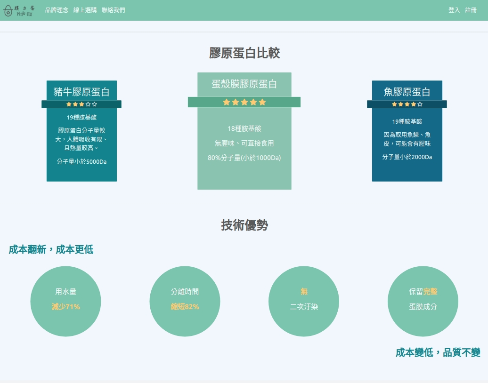
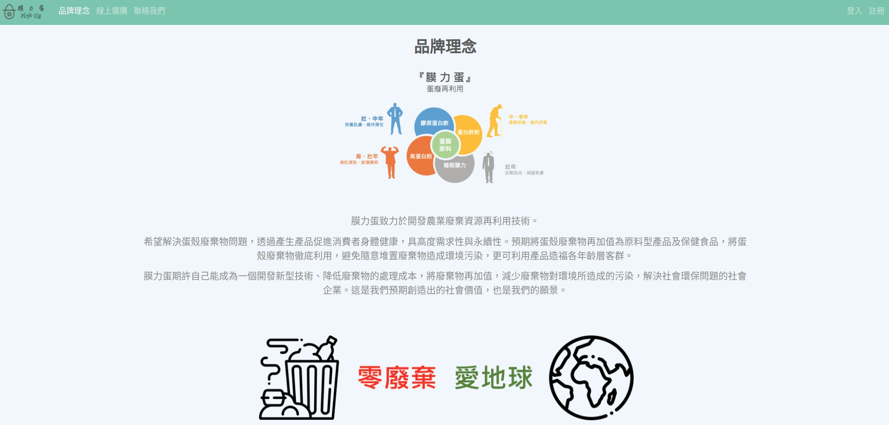
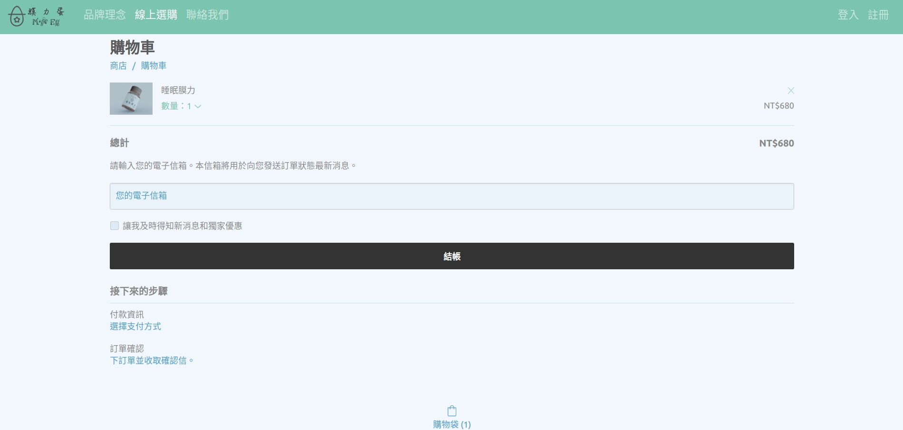
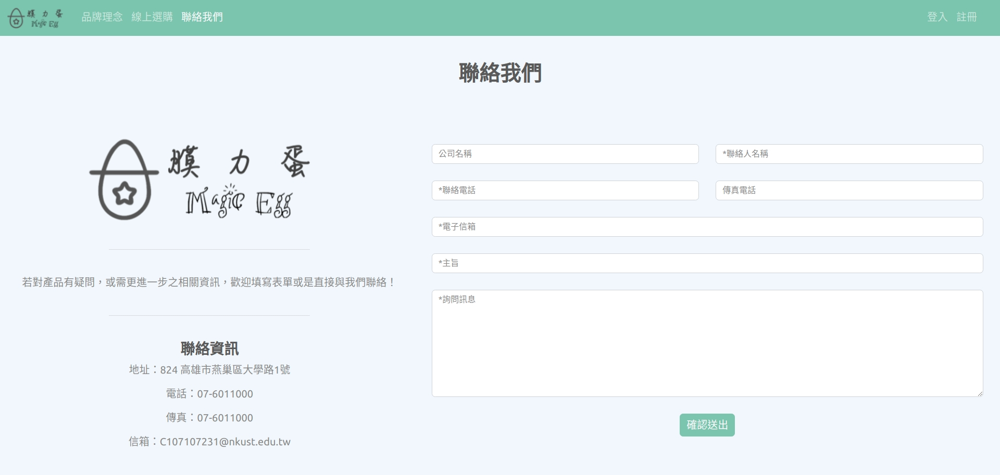
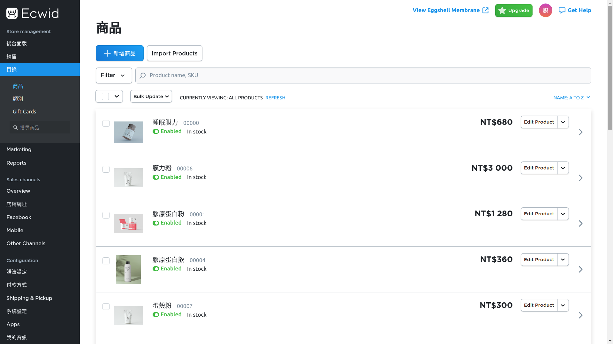
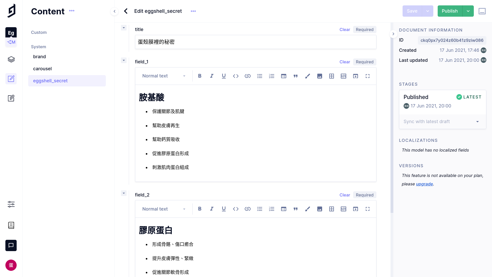

# eggshell-membrane

This is a e-commerce website for my school-project.

## Demo

[實際網站](https://eggshell-membrane.netlify.app/)

- 主頁:

    

    

- 品牌理念:

    

- 線上選購:

    

- 商品頁面:

    

- 購物車:

    

- 聯絡表單:

    

- 購物系統後台(使用Ecwid平台服務):

    

- 資料庫後台(使用GraphCMS平台服務):

    

## Technologies

- Architecture : JAM-Stack (Serverless Stack)

- Language : Node.js, Typescript

- Frontend : Vanilla HTML/CSS/Javascript (using webpack to bundle all of them)

- Backend : Netlify Serverless Function

- Database : GraphCMS (GraphQL)

- E-commerce : Ecwid

- Deployment : Netlify

## Local Development

1. install `netlify-cli` globally via npm:

    ```bash
    $ sudo npm install -g netlify-cli
    ```

2. setting Environment Variables via `netlify-cli`:

    ```bash
    $ netlify env:set GRAPHQL_ENDPOINT <your-GraphCMS-token>
    ```

3. build the project:

    ```bash
    $ npm run build-netlify
    ```

4. run the project via `netlify-cli`:

    ```bash
    $ netlify dev

    ◈ Netlify Dev ◈
    ◈ Injected build settings env var: GRAPHQL_ENDPOINT
    ◈ Ignored general context env var: LANG (defined in process)
    ◈ Ignored general context env var: LANGUAGE (defined in process)
    ◈ No app server detected. Using simple static server
    ◈ Running static server from "eggshell-membrane/assets"
    ◈ Loaded function brands.
    ◈ Loaded function carousels.
    ◈ Loaded function config.
    ◈ Loaded function eggshell-secret.
    ◈ Functions server is listening on 35787

    ◈ Static server listening to 3999

    ┌─────────────────────────────────────────────────┐
    │                                                 │
    │   ◈ Server now ready on http://localhost:8888   │
    │                                                 │
    └─────────────────────────────────────────────────┘
    ```
